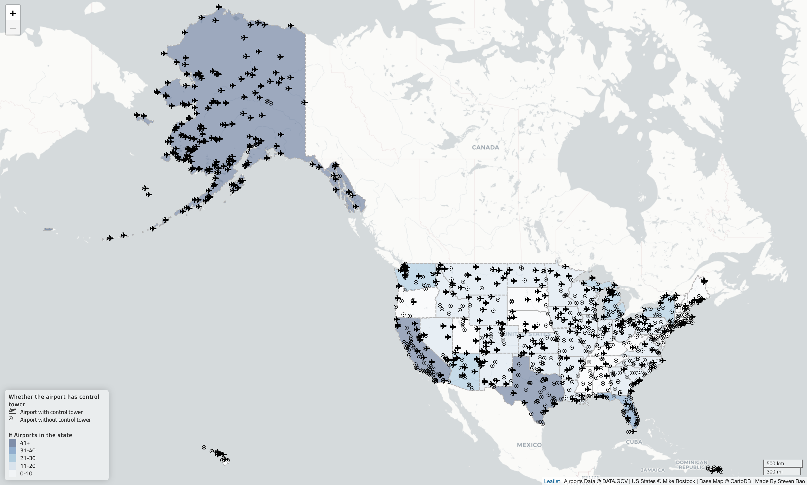

## Airports in the United States

***Author: Steven Bao***

### Project Preview

### Introduction

This project is a geovisualization of the airports with and without air traffic control towers in the United States. The color of a state represents the total number of airports located within the state. By hovering the mouse over the plane icon, users will be able to see the airport name and the city it locates in.

The project uses `leaflet` and `leaflet-ajax` JavaScript libraries. The data for the project are acquired from [DATA.GOV](https://catalog.data.gov/dataset/usgs-small-scale-dataset-airports-of-the-united-states-201207-shapefile) and [Mike Bostock](http://bost.ocks.org/mike). The basemap is provided by CartoDB.

